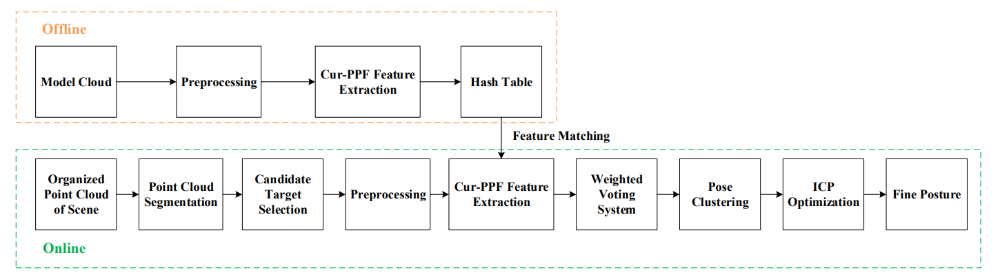

# 研究三通管模型點雲來bin pick 
## 本研究基於[這篇](https://github.com/harry123180/binpick_research/blob/main/3D%E9%BB%9E%E9%9B%B2%E6%A9%9F%E6%A2%B0%E6%89%8B%E8%87%82%E5%A4%BE%E5%8F%96%E5%A7%BF%E6%85%8B%E6%8E%A8%E4%BC%B0.pdf)來進行研究

## 舉哥從Offline出發->第一步建立Model Cloud
## 下一步是預處理
